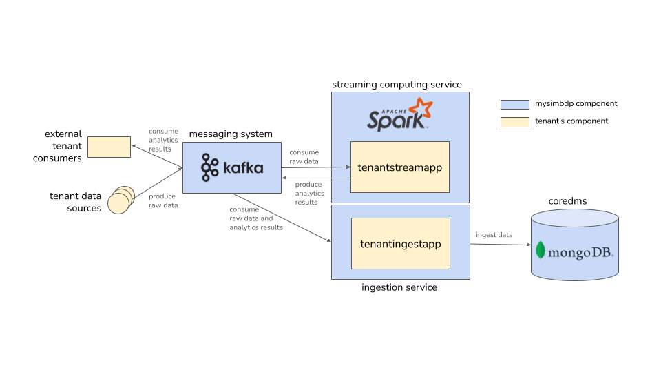

# BDP 3: Big Data Stream Processing

This repository contains the design for a multi-tenant stream processing platform based on Apache Kafka and Apache Spark
that is suitable for big data workloads as well as a sample implementation of a tenant stream processing application.

A detailed report on the implementation and related considerations can be found [here](reports/Assignment-3-Report.md).

## Overview

* **Tenant data sources**: The tenant data sources in this scenario are sensors that send measurements to the messaging
  system in near real-time. There are thousands of sensors that send data in parallel. For other tenants, the data
  sources could be different, e.g. interaction data streams from a web application.

* **`mysimbdp` messaging system**: The messaging system is powered by Apache Kafka and serves as the central
  communication hub between both the different components of `mysimbdp` and external components.

* **`mysimbdp` streaming computing service**: The streaming computing service is powered by Apache Spark and provides
  the infrastructure for the tenants to run their stream analytics.

* **Tenantstreamapp**: The `tenantstreamapp`s are implemented by the tenant and handle the actual analytics. They run
  atop the Spark cluster/`mysimbdp` streaming computing service. They consume data from the topics in the messaging
  system, process the data, and publish the results back to the messaging system. In this case, the `tenantstreamapp` is
  implemented using Spark Structured Streaming. Each `tenantstreamapp` is a separate Spark job that can be provisioned
  by the tenant according to their needs. The tenant can decide whether they want to use the results of the analytics
  externally, whether they want to ingest them into the `mysimbdp-coredms`, or both. If using externally, they can just
  subscribe to the Kafka topic where the results are published. If ingesting into the core DMS, they can use
  streamingestapp running atop the mysimbdp ingestion service that was developed in the previous assignments.

* **Ingestion service**: The ingestion service was developed in [Assignment 2](https://github.com/evelynbirnzain/BDP_2)
  and runs tenant's stream ingestion jobs. It may use the same infrastructure and management components as the streaming
  computing service, but differs in its aim, which is to host light-weight ingestion jobs that move data to
  the `coredms` with some minimal wrangling as opposed to applications that perform more complex analytics.

* **Tenantingestapp**: `tenantingestapps` run atop the ingestion service and move both raw and processed data into the
  `coredms`. Sample ingest apps were developed in the last assignment and can be reused here.

* **`mysimbdp-coredms`**: The `mysimbdp-coredms` is a MongoDB that is used for storing both the raw data and the
  analytics results. 

## Deployment
Instructions on how to deploy the system can be found in the [deployment guide](reports/Assignment-3-Deployment.md).
