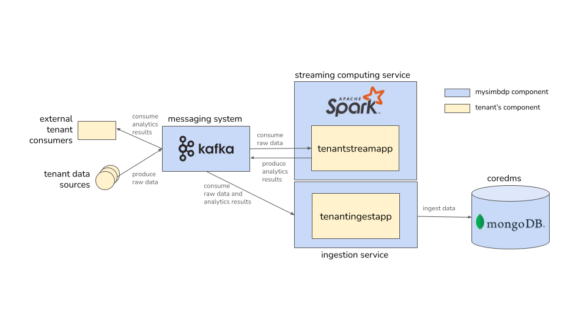
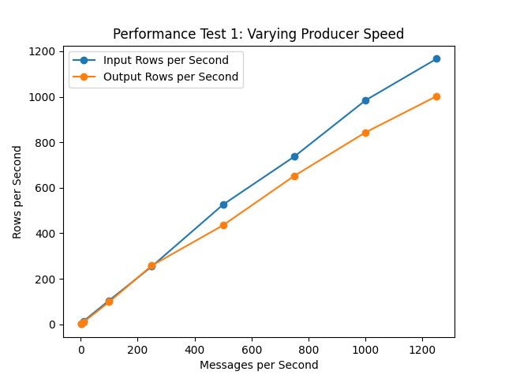
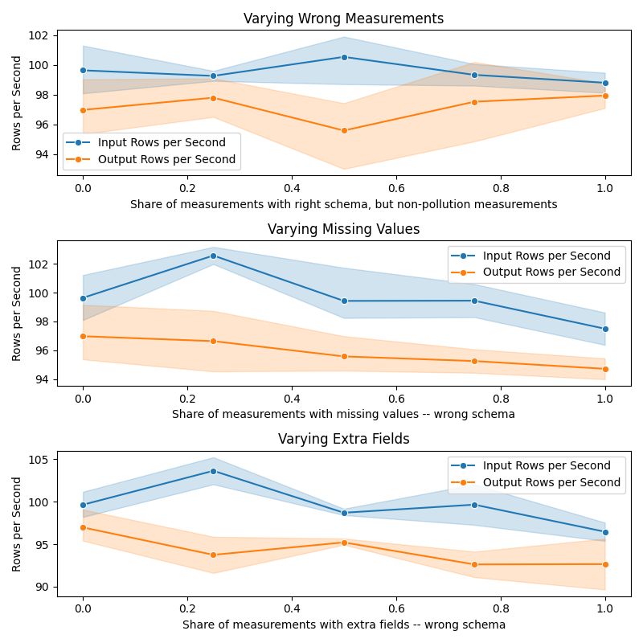
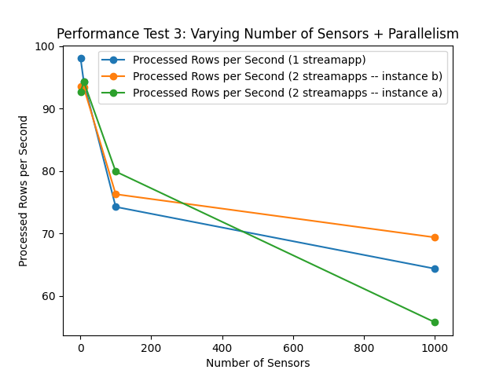
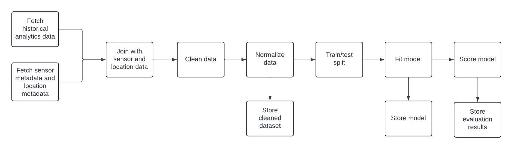
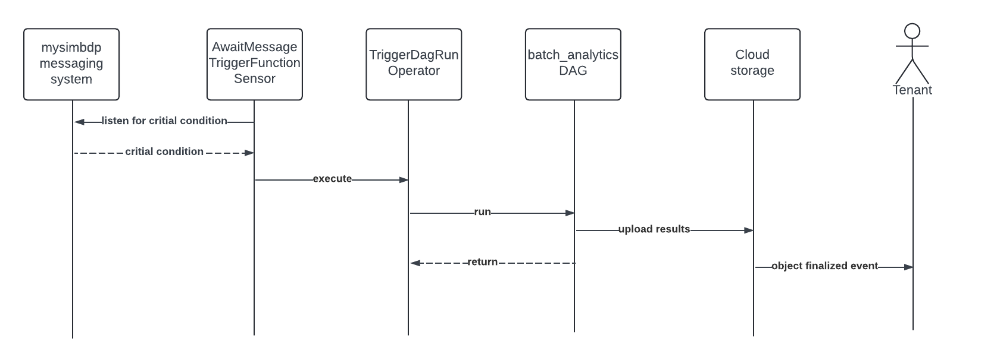

# Assignment report

## Part 1 - Design for streaming analytics (weighted factor for grades = 3)

1. _As a tenant, select a dataset suitable for streaming data analytics as a running scenario. Explain the
   dataset and why the dataset is suitable for streaming data analytics in your scenario. As a tenant,
   present at least two different analytics: (i) a streaming analytics (`tenantstreamapp`) which analyzes
   streaming data from the tenant and (ii) a batch analytics, using the workflow model, which analyzes
   historical results outputted by the streaming analytics. The explanation should be at a high level to
   allow us to understand the data and possible analytics so that, later on, you can implement and use
   them in answering other questions. (1 point)_

I selected the
[open dataset about air quality monitoring from Germany](https://github.com/opendata-stuttgart/meta/wiki/EN-APIs).
The dataset consists of measurements taken by thousands of sensors across Europe. There are two main types of sensors,
one measuring weather-related data such as temperature, humidity, and air pressure; the other one measures air
pollution. In the current tenant's use case, I chose to focus on sensors which provide measurements of air pollution
levels.

The dataset is suitable for streaming analytics since it consists of small measurements that, in a real-life
scenario, arrive at a high volume and in near real-time; there is a large number of applications for processing the
data in near real-time that are much more involved than just storing the data.

(i) If we consider the air pollution sensors, we could use streaming analytics to e.g. do short-term aggregation of
measurements for a near real-time air quality index that takes into account multiple type of pollution or detect
pollution spikes so that alerts can be sent out to concerned citizens. We could also use it for monitoring the sensors
themselves for malfunctions (if a sensor stops sending measurement or the measurements are abnormal compared
to other nearby sensors).

(ii) For batch analytics, we could use the historical data to build a model that we can then feed with the
near real-time data to predict future air pollution levels. We could also use the historical data
to detect long-term trends in air pollution or weather conditions.

2. _The tenant will send data through a messaging system, which provides stream data sources. Discuss,
   explain and give examples for the following aspects in the streaming analytics: (i) should the
   streaming analytics handle keyed or non-keyed data streams for the tenant data, and (ii) which types
   of message delivery guarantees should be suitable for the stream analytics and why. (1 point)_

(i) It would make sense to key/partition the data based on the sensor id, so that all measurements from the same sensor
can be processed together. Like this, it is straightforward e.g. calculate the average pollution level for a sensor
in a time windows to create a less noisy air quality index, detect malfunctioning sensors, or detect pollution spikes
based on the trend of the measurements in that one sensor. Additionally, keying the data allows for parallel processing
of the data (**data parallelism**), as the data from different sensors can be processed independently; there are many
sensors, keying by sensor id would allow for a good distribution of the data across the cluster.

(ii) Generally, I think all the delivery guarantees could be suitable here. I would be nice to have exactly once
delivery for maximum accuracy, but it is not strictly necessary, as there is no big penalty for some measurements
getting lost in transit (the resulting picture would just be slightly less complete). There is also no substantial
penalty if a measurement is processed more than once, at worst the result might be slightly skewed. Based on these
considerations, I would say that a possible performance penalty for going with exactly once delivery would probably not
be worth it. Since the data is not critical and it would be fine if some measurements are lost, at most once
delivery would be sufficient; if the platform provider can guarantee at least once delivery, that is good too.

3. _Given streaming data from the tenant (selected before). Explain and give examples in your
   explanation for the following points: (i) which types of time should be associated with stream data
   sources for the analytics and be considered in stream processing (if the data sources have no
   timestamps associated with records, then what would be your solution), (ii) which types of windows
   should be developed for the analytics (if no window, then why), (iii) what could cause out-of-order
   data/records with your selected data in your running example, and (iv) will watermarks be needed or
   not and explain why.(1 point)_

(i) As-is, the measurements come with a timestamp that gives the time the measurement was taken (**event time**). This
is the time we would be most interested in when drawing conclusions from the data. If the data didn't come with a
timestamp recording the event time, I would try to approximate the event time as close as possible -- i.e. the time the
message was received by the messaging system (**ingestion time**, recorded by Kafka). This is much more inaccurate, as
there can be great variance in how long measurements take in transit, and they might arrive out of order. If all else
fails, the time the message was processed by the stream processing system (**processing time**, given by Spark) could be
used, but this should not be necessary in this case. For system-level analytics it could also be interesting to look at
the latency between the different timestamps to check for performance issues in the system, e.g. is there a big latency
between ingestion time and processing time?

(ii) Generally, the options would be tumbling windows, sliding windows, and session windows. For the air quality data,
session windows would not really make sense as there is no session per se. Tumbling windows could be used to calculate
e.g. an hourly air quality index. Sliding windows seems like the most interesting option here, as it would allow us to
calculate e.g. a rolling average of the different pollution levels over the last hour, which could then be further
aggregated to calculate an overall air quality index or send out alerts if pollution levels cross a threshold. In this
case in particular, I would pick time-based windows as opposed to count-based windows (discussed in the lecture), as the
measurements may not arrive at a constant rate and we want to have a good estimate of the air quality
at all times. I chose to implement a sliding window of 15 minutes with a slide of 5 minutes in the `tenantstreamapp`
that aggregates the average pollution levels for each sensor and pollution type.

(iii) Out-of-order data can mainly be caused by network issues, where some messages are delayed and arrive after
messages that were sent earlier already arrived. In this case, this can be very much the case, since the sensors are
heavily distributed. The sensors are also located in different countries with possibly different time zones that are not
indicated in the event timestamps that are associated with the measurements, so this could also cause technically
out-of-order data that the system might have trouble handling.

(iv) Watermarks should be used so that the stream processing system can close each window in a reasonable time so that
the results become available in a timely manner, even if some measurements are delayed - we want a good estimate of the
analytics results to become available as soon as possible, even if the data is not complete yet. Measurements that are
very late (e.g. because of network issues) can just be dropped; they aren't necessary for the near real-time computation
anymore. Additionally, we calculate sliding windows for each sensor, which means that there are thousands of windows
open at any given time, and we want to close them as soon as possible to minimize the amount of data that needs to be
kept in memory.

4. _List important performance metrics for the streaming analytics for your tenant cases. For each
   metric, explain (i) its definition, (ii) how to measure it in your analytics/platform and (iii) its
   importance and relevance for the analytics of the tenant (for whom/components and for which
   purposes). (1 point)_

* Latency (several flavours)

  (i) The time delta between when a measurement was taken (event time, t_0) and when the result of the analytics is
  available (t_2). We can also measure the time delta between ingestion time (t_1) and processed time (t_2).

  (ii) The measurements are timestamped on generation, which gives us t_0. The ingestion time is recorded by Kafka (
  t_1). The processing completion is again recorded as soon as the results enter the messaging system (t_2). If getting
  the exact timespan is important, I would use a separate Spark job that subscribes to both the input and output Kafka
  topics, correlates the measurements with the results, and calculates the two latencies discussed above (t_2-t_0,
  t_2-t_1). Otherwise, we could also look at e.g `batchDuration` in the Spark Structured Streaming API to get an idea of
  what is the processing time for each microbatch.

  (iii) The overall latency (t_2-t_0) is crucial for the tenant to know so they can gauge how quickly they can react to
  changes in the data; it the latency is too high, the results might not be relevant anymore. Also measuring t_2-t_1
  allows the tenant to gauge whether the problem is network latency or the performance of their processor. If it's the
  latter they can try to optimize the processor.

* Throughput

  (i) The number of measurements processed per unit of time (e.g. per second). We can look at the throughput of an
  individual processor, the total throughput of all the tenants relevant processors.

  (ii) The throughput of a streaming query is measured by Spark itself automatically; the `processedRowsPerSecond`
  metric corresponds to the throughput. The total throughput can be aggregated across the different processors by
  logging the throughput of each processor and summing them up post-hoc.

  (iii) The throughput is important for the tenant to know how many measurements they can process at any given time.
  If they know that one processor can process x measurements per second and they plan to expand the IoT network, they
  know how many more processors they would need to provision. Additionally, if the throughput is too low, the tenant
  can try to optimize the processor to increase the throughput.

* Resource utilization

  (i) The percentage of resources used by the processor (e.g. CPU, memory).

  (ii) The resource utilization is shown in the Spark master's web UI, but can also be accessed via an API. This is not
  information that the tenant can access directly, but the platform provider can provide an API for the tenant to
  access this information.

  (iii) The resource utilization is important for the tenant to know so they can adapt how many resources they provision
  for the processor; if they have a very light-weight processor, they can provision it on a smaller machine to save
  costs instead of having it sit mostly idle.

5. _Provide a design of your architecture for the streaming analytics service in which you clarify: tenant
   data sources, mysimbdp messaging system, mysimbdp streaming computing service, tenant
   streaming analytics app, `mysimbdp-coredms`, and other components, if needed. Explain your choices
   of technologies for implementing your design and reusability of existing assignment works. Note
   that the result from `tenantstreamapp` will be sent back to the tenant in near real-time and/or will be
   ingested into `mysimbdp-coredms`. (1 point)_

The overall architecture design is shown below. Each component and its interactions with other system components are
explained in the following paragraphs. I also mention which components were developed in the previous assignments and
are not included here anymore.



* **Tenant data sources**: The tenant data sources in this scenario are sensors that send measurements to the messaging
  system in near real-time. There are thousands of sensors that send data in parallel. For other tenants, the data
  sources could be different, e.g. interaction data streams from a web application. I developed a producer script to
  simulate the sensors in the previous assignments and adapted it for this assignment.

* **`mysimbdp` messaging system**: The messaging system is powered by Apache Kafka and serves as the central
  communication hub between both the different components of `mysimbdp` and external components. I chose Kafka as the
  messaging system as opposed to Pulsar it is more widely used and mature. I also used it in the previous assignments,
  so was familiar with it an reuse some code (producers, setup). Overall, it is well-suited in this scenario, as it
  can comfortably handle the high volume of messages that the sensors send, it's fault-tolerant, and it can be easily
  integrated with Spark Structured Streaming, which is used for the stream analytics. In the test setup, I use only one
  Kafka broker, but it can be easily scaled out to a cluster of brokers for higher throughput and fault tolerance. The
  same messaging system can be used for ingestion (2nd assignment) and streaming analytics.

* **`mysimbdp` streaming computing service**: The streaming computing service is powered by Apache Spark and provides
  the infrastructure for the tenants to run their stream analytics. Though Spark is not streaming-first like Flink, it
  can still handle streaming data well via e.g. the Spark Structured Streaming API. It might be important to note here
  that Spark uses micro-batching when handling streaming data as opposed to "true" streaming; however, this is not a
  problem in this scenario, as the latency requirements are not that extreme. I chose Spark as the streaming computing
  service as opposed to Flink because of the less steep learning curve which is good for myself and also makes using the
  platform more accessible to more tenants. Spark uses one master node that assigns jobs to multiple worker nodes. The
  streaming computing service can use the very same management components that were used for the ingestion service in
  the last assignment (i.e. manager for starting and stopping, monitor for tracking metrics and alerting).

* **Tenantstreamapp**: The `tenantstreamapp`s are implemented by the tenant and handle the actual analytics. They run
  atop the Spark cluster/`mysimbdp` streaming computing service. They consume data from the topics in the messaging
  system, process the data, and publish the results back to the messaging system. In this case, the `tenantstreamapp` is
  implemented using Spark Structured Streaming. Each `tenantstreamapp` is a separate Spark job that can be provisioned
  by the tenant according to their needs. The tenant can decide whether they want to use the results of the analytics
  externally, whether they want to ingest them into the `mysimbdp-coredms`, or both. If using externally, they can just
  subscribe to the Kafka topic where the results are published. If ingesting into the core DMS, they can use
  streamingestapp running atop the mysimbdp ingestion service that was developed in the previous assignments.

* **External tenant consumers**: The tenant may wish to process or otherwise use the results of the streaming analytics
  outside of `mysimbdp`. To do this, they can simply subscribe to the Kafka topic where the results are published.

* **Ingestion service**: The ingestion service was developed in Assignment 2 and runs tenant's stream ingestion jobs. It
  may use the same infrastructure and management components as the streaming computing service, but differs in
  its aim, which is to host light-weight ingestion jobs that move data to the `coredms` with some minimal wrangling as
  opposed to applications that perform more complex analytics.

* **Tenantingestapp**: `tenantingestapps` run atop the ingestion service and move both raw and processed data into the
  `coredms`. Sample ingest apps were developed in the last assignment and can be reused here.

* **`mysimbdp-coredms`**: The `mysimbdp-coredms` is a MongoDB that is used for storing both the raw data and the
  analytics results. As in the previous assignments, I chose MongoDB for the `coredms` because it is flexible and
  schema-less, which makes it easy to store the semi-structured data that the sensors in this scenario send.

# Part 2 - Implementation of streaming analytics (weighted factor for grades = 3)

1. _As a tenant, implement a `tenantstreamapp`. For code design and implementation, explain (i) the
   structures/schemas of the input streaming data and the analytics output/result in your
   implementation, the role/importance of such schemas and the reason to enforce them for input data
   and results, and (ii) the data serialization/deserialization for the streaming analytics application
   (`tenantstreamapp`). (1 point)_

(i) The schema of the **input data** can be found in [schema.py](../code/tenantstreamapp/schema.py). On a high level,
each input measurement has an id, timestamp, location, sensor metadata, and some "actual" measurement data. The actual
measurement data consists of a list of measurements, each with a type and a value (e.g. P1, 20.0). It is important to
note that each measurement sent in a semi-structured format and is a nested object, as there is quite a lot of metadata
for each sensor and location. Since there are different types of sensors that take different types of measurements, each
measurement need to define its type instead of having a fixed list of fields in the schema. This way, the schema can be
extended to include new types of measurements without having to change the schema itself. However, this also means that
we need to check which measurement types are available in each measurement and decide how to handle them.

The schema of the **output data** is much simpler, as all metadata is discarded during processing; it is sufficient to
know the sensor id, the pollution type, and the pollution level, as well as the time window the pollution level was
measured in. The output data is published to a Kafka topic in JSON format, where each message has the following schema:

```json
{
  "sensor_id": "string",
  "pollution_type": "string",
  "pollution_level": "double",
  "window": {
    "start": "timestamp",
    "end": "timestamp"
  }
}
```

On a general level, it is important to enforce schemas for both the input and result data to ensure that the data is
correctly processed by both the `tenantstreamapp` and the tenant. If the `coredms` wasn't document-based but rather a
relational database, the schema would also need to be enforced
for being able to store the results in the database at all; for MongoDB, checking the schema is optional. Enforcing the
schema also makes sure that wrong data that accidentally gets into the system is caught early and can be handled
appropriately instead of causing errors or wrong results further down the line. In this case, the schema is enforced by
the Spark SQL JSON deserializer `from_json` when reading the input stream.

When talking about Spark Structured Streaming specifically,
the [documentation](https://spark.apache.org/docs/latest/structured-streaming-programming-guide.html) states that the
schema is needed to make sure that streams are processed using a consistent schema even in the case of failures, and
some operations need the type information at compile time already to work correctly.

(ii) The input data is JSON serialized and binary encoded so that it can be handled by Kafka. Upon ingestion into the
messaging system, each measurement becomes a Kafka message with the key being the sensor id and the value being the JSON
serialized measurement, as well as some metadata (e.g. timestamp i.e. ingestion time, topic, partition, offset).
The `tenantstreamapp` uses Spark Structured Streaming to read the input stream using the SS Kafka connector and then
decodes and deserializes the JSON data using both the schema described above and the Spark SQL JSON
deserializer `from_json`. The results/output data are then serialized back to JSON and published to a Kafka topic using
the SS Kafka connector.

2. _Explain the logic of the functions for processing events/records in `tenantstreamapp` in your
   implementation. Explain under which conditions/configurations and how the results are sent back to
   the tenant in a near real time manner and/or are stored into `mysimbdp-coredms` as the final sink. (1 point)_

**Logic**

The logic of the `tenantstreamapp` is as follows:

* **Load** the input stream from Kafka using the SS Kafka connector.
* **Parse** the value of the Kafka messages using JSON data using the schema described above.
* **Map and filter**: Explode the measurements array into individual measurements that can be processed separately,
  filter out measurements that are not relevant for the analytics (e.g. measurements that are not air pollution
  measurements).
* **Aggregate**: Using a sliding window of 15 minutes, calculate the average pollution level for each sensor and
  pollution type, with a slide of 5 minutes. This is done using the `groupBy` and `window` functions in Spark Structured
  Streaming. The watermark is set to 5 minutes to handle late data, which allows us to close the windows quite quickly.
* **Filter for spikes**: Find the sensors that have measured an average pollution level above a certain threshold in the
  last 15 minutes.
* **Publish results**: Results are published to two different sinks based on whether they exhibit concerning pollution
  levels or not. All results are published to the "report" Kafka topic using the SS Kafka connector. The alarming
  results are also published to the "alert" Kafka topic.

**Sinks**

By publishing the results back to Kafka, all results are _always_ sent back to the tenant in near real time, or at
least available for the tenant to consume. They can just implement their own Kafka consumer that uses the results
externally/back on site with the tenant. The tenant can additionally choose to store the results in `mysimbdp-coredms`
for later use.

For storing the results in `mysimbdp-coredms`, I considered two main options:

1. directly ingesting the results into `mysimbdp-coredms` using the SS Mongo connector as they calculated;
   this would be done within the `tenantstreamapp` itself, or
2. publishing the results to a Kafka topic as an intermediate step and then ingesting them into `mysimbdp-coredms`
   using a separate Spark job a la `tenant-streamingest`.

I decided to go with the _second_ option as it allows for more flexibility and scalability, and decouples analytics
from ingestion. This way, the tenant can decide to use the results in other ways than just storing them
in `mysimbdp-coredms` without having to change the `tenantstreamapp` itself. Additionally, the jobs can be scaled
independently, and the ingestion process can be optimized separately from the analytics process.

3. _Explain a test environment for testing `tenantstreamapp`, including how you emulate streaming data,
   configuration of `mysimbdp` and other relevant parameters. Run `tenantstreamapp` and show the
   operation of the `tenantstreamapp` with your test environments. Discuss the analytics and its
   performance observations when you increase/vary the speed of streaming data. (1 point)_

**Emulating streaming data**

I used real measurements from the dataset as basis for the test data. To emulate different latencies and out-of-order
data, I implemented a Pyton script ([producer.py](../code/test-environment/producer.py)) that
reads the measurements from the dataset and sets the timestamp to the current time minus a random delay. The script
takes two command line arguments: the delay between sending measurements (which is used to control the speed of the
stream) and the number of sensors to emulate, which can be used to vary the number of windows that need to be kept
open in memory. The data is published to the "measurements" Kafka topic using the Kafka producer API.

**Configuration of `mysimbdp`**

I used a local setup (see also [Assignment-3-Deployment.md]) with an individual Kafka
broker (+ Zookeeper) and a Spark cluster with one master and one worker. The worker gets 1 core and 1 GB of
memory. For this test, I only used one concurrent `tenantstreamapp`, as the focus of the test was the changes in
performance when varying the speed of the stream; parallelism is discussed in question 2.5. I ran the producer with
different delays to emulate different streaming speeds, with speeds between 1 and 1250 messages per second (this was the
maximum producer speed that I was able to consistently achieve with the local setup). I ran the ingestion for each speed
for 5 minutes to even out fluctuations and get a good average performance. After the 5 minutes, I aggredated the metrics
from the logs and waited for the tenantstreamapp to go idle before moving on to the next speed.

**Performance observations**



As shown in the plot, the input rate that is recorded by the `tenantstreamapp` is consistently very close to the rate
at which the messages are produced, which indicates that the messaging system is not a bottleneck. The processing rate
perfectly matches the input rate up until ~250 messages per second, after which the processing rate starts to slightly
diverge from the input rate. This indicates that the processor cannot fully keep up with the input rate anymore, which
means increased latency and that the processor should either be optimized or scaled out to handle the increased load.

4. _Present your tests and explain them for the situation in which wrong data is sent from or is within
   the data sources. Explain how you emulate wrong data for your tests. Report how your
   implementation deals with that (e.g., exceptions, failures, and decreasing performance). You should
   test with different error rates. (1 point)_

**Types of wrong data & handling them**

I considered several types of "wrong" data that are handled differently by the stream app.

1. Data has the correct schema, but does not contain the measurement types that are handled by this stream app. The
   measurement is discarded which, semantically, leads to a performance decrease, as the processor can only handle so
   many input rows per second, and now some of these rows are "wasted". However, the processing rate itself stays the
   same.
2. Data is missing fields that are required; or data is missing values for fields that are not nullable. The measurement
   cannot be processed and is discarded.
3. Data contains fields that are not specified in the schema. These fields can be ignored and the measurement can still
   be processed. Alternatively, the measurement can be discarded due to the schema violation, as it could mean that the
   measurement was sent from a sensor that can otherwise not be handled.

**Test design and performance**

For each of the three error types discussed above, I ran tests with an error rate in between 0% and 100% with a step of
25%. For each test, I streamed the data for 5 minutes (to even out fluctuations) at a rate of 100 messages per second,
during which time the `tenantstreamapp` logged the metrics to MongoDB (here, mainly `processedRowsPerSecond`
and `inputRowsPerSecond`). After the fact, I aggregated the metrics over the specified time frame and calculated the
averages for each error rate.

The results can be seen below. For the first error type (right schema, but no relevant measurements) the processing rate
stays the same, as the measurements still need to largely be processed before it can be determined that they are not
relevant. For the second error type (missing fields), the processing rate decreases with the error rate, as more
measurements need to be discarded. For the third error type (extra fields), the processing rate also decreases with the
error rate, which highlights that the processor in its current implementation is strict about the schema and does not
allow for extra fields.



5. _Explain parallelism settings in your implementation (`tenantstreamapp`) and test with different
   (higher) degrees of parallelism for at least two instances of `tenantstreamapp` (e.g., using different
   subsets of the same dataset). Report the performance and issues you have observed in your testing
   environments. Is there any situation in which a high value of the application parallelism degree could
   cause performance problems, given your limited underlying computing resources (1 point)_

**Types of parallelism in the `tenantstreamapp`**

* **Data parallelism**: The measurement streams are keyed on the sensor id. For `n` sensors, this theoretically enables
  having up to  `n` concurrent `tenantstreamapps` doing the same processing of different subsets of the data, one task
  per sensor. Measurements for each key are sent to the same Kafka topic partition. However, each partition will only be
  processed by one consumer in a consumer group; therefore, a sufficient number of partitions need to be created to
  allow for parallel processing.
* **Task parallelism**: There is some task parallelism as-is, as each `tenantstreamapp` takes care of both general data
  cooking/reporting and also reports the pollution spikes separately. These two tasks are handled at the same time,
  concurrently streaming results to separate sinks, therefore creating task parallelism. It would be possible to create
  more task parallelism by creating different `tenantstreamapp`s which handle different aspects of the analytics.

**Test design**

I created 64 partitions to allow for a decent degree of data parallelism and load balancing between
the `tenantstreamapp`s. The `tenantstreamapps` register as part of the `Pollution_Monitor` consumer group, to enable the
parallel processing; Kafka handles balancing the partitions between the consumers. I started two worker nodes with 1GB
RAM and 1 core each. I then submitted 1-2 `tenantstreamapp`s and measured the performance for each configuration.
I streamed data at 100 messages per second originating from 1 to 1000 sensors for 5 minutes for each configuration.

**Performance**
As shown below, the processing rate drops significantly as the number of sensors increases (while maintaining the same
message rate), which likely is due to the much larger number of windows that needs to be managed concurrently.
Interestingly, the processing rate in the same per tenantstreamapp regardless of whether there is one or two of them,
which indicates that the consumer group may not be working as intended. Unfortunately, I was not able to investigate
this further due to time.



**Issues with high parallelism**
More parallelism inevitably comes with more overhead, so there is a point where adding more parallelism will not
increase the processing rate anymore or will even decrease it, as the management overhead becomes too large. Another
issue is that since the streamapps request a fixed amount of resources, there comes a time where additional apps will
simply not be scheduled anymore.

# Part 3 - Extension (weighted factor for grades = 2)

1. _Assume that you have an external RESTful (micro) service, which accepts a batch of data (processed
   records), performs an ML inference and returns the result. How would you integrate such a service
   into your current platform and suggest the tenant to use it in the streaming analytics? Explain what
   the tenant must do in order to use such a service. (1 point)_

To keeps things simple and decoupled, I would suggest that the tenant keeps the `tenantstreamapp` as-is and does not try
to integrate communication with the microservice directly into the `tenantstreamapp` that is responsible for analytics;
this way, they also avoid possible data loss if the microservice in unavailable or slow and are able to scale the two
components independently.

Instead, they could implement a separate Spark processor (e.g. `ML-inference-processor`) that reads the results from the
Kafka topic where the results are published and sends them to the microservice in batches. The Spark processor could
still operate using the Spark Structured Streaming API, reading the results from the Kafka topic periodically and
sending them to the microservice in batches -- this could be done by e.g. using fixed interval micro-batching to collect
a batch of results and then sending using the `foreachBatch` sink. The tenant would also need to implement a simple REST
POST function that can be passed to `foreachBatch`. In this case, the platform provider would be completely hands-off
and the tenant would have maximum control over the integration.

Alternatively, I, as the platform provider, could implement the `ML-inference-processor` myself and offer it as a
service to the tenant. The tenant could then provision the processor from the platform provider with a custom
configuration (the topic to read from, the topic to write to, interval between sending batches, etc.). The tenant would
then only need to configure the `tenantstreamapp` to publish the results to the correct Kafka topic and consume the
inference results from the correct Kafka topic.

In this particular case, the tenant could use the microservice to e.g. make a forecast of the individual pollution
levels, which is very much along the lines of what I discussed earlier (building a model on the historical data).

2. _Given the output of streaming analytics stored in `mysimbdp-coredms`. Explain a batch analytics (see
   also Part 1, question 1) that could be used to analyze such historical output for your scenario.
   Assume you have to design the analytics with the workflow model, draw the workflow of the batch
   analytics and explain how would you implement it? (1 point)_

As briefly mentioned in Part 1, question 1, batch analytics could be used to build a model based on historical data
that can then be used to predict future air pollution levels or weather conditions.

The workflow for the batch analytics could look roughly like this:

* Fetch the historical analytics data from `mysimbdp-coredms` using the SS Mongo connector. || Read sensor metadata and
  location data from `mysimbdp-coredms`.
* Join the data from the separate sources.
* Preprocess the data to e.g. remove outliers, fill in missing values.
* Normalize the data and save.
* Split the data into train and test set.
* Train model on the training set using e.g. Spark MLlib and save to `coredms`.
* Score model on the test set and save the evaluation results.



3. _Assume that the streaming analytics detects a critical condition (e.g., a very high rate of alerts) that
   should trigger the execution of the above-mentioned batch analytics to analyze historical data. The
   result of the batch analytics will be shared in a cloud storage and a user within the tenant will receive
   the information about the result. Explain how would you use workflow technologies to coordinate
   these interactions and tasks (use a figure to explain your design). (1 point)_

Given that we use Airflow as a workflow orchestrator, I would use a sensor (e.g. AwaitMessageTriggerFunctionSensor) to
check Kafka/the messaging system for alerts about a critical condition. If a critical condition is detected, the sensor
triggers the execution of the batch analytics by using a TriggerDagRunOperator to kick off the batch analytics workflow.
The batch analytics workflow does its thing (any interactions are omitted here) and writes the results to a cloud
storage bucket. The tenant subscribes to the cloud storage bucket for the results and is notified (e.g. object finalized
event in Google Cloud storage) when the results are available.



4. _Given your choice of technology for implementing your streaming analytics. Assume that a new
   schema of the input data has been developed and new input data follows the new schema (schema
   evolution), how would you make sure that the running `tenantstreamapp` does not handle a wrong
   schema? Assume the developer/owner of the `tenantstreamapp` should be aware of any new schema
   of the input data before deploying the `tenantstreamapp`, what could be a possible way that the
   developer/owner can detect the change of the schemas for the input data. (1 point)_

I would add a field `schema_version` to the input data schema; each producer then needs to set the schema version
which it uses. Each `tenantstreamapp` that is deployed is instrumented with the schema version that it is able to
handle and checks each measurement for schema version compatibility before processing. However, as
the `tenantstreamapp`s all belong to one consumer group and each message is processed exactly once within a consumer
group, we need to make sure that the measurements that were consumed by an incompatible app aren't just discarded.
Therefore, would suggest registering all "new" `tenantsstreamapp`s as part of a separate consumer group. This means
that for a while, during the rollout of the new schema, all messages are seen by both old and new apps, which then
decide based on the schema version which messages they can properly process. When all messages with the old schema
version have been processed, the old `tenantstreamapps`s can be retired and the new ones fully take over.

5. _Is it possible to achieve end-to-end exactly once delivery in your current `tenantstreamapp` design
   and implementation? If yes, explain why. If not, what could be conditions and changes to achieve end-
   to-end exactly once? If it is impossible to have end-to-end exactly once delivery in your view, explain
   the reasons. (1 point)_

The current design and implementation do not support exactly-once delivery, as we are using Kafka as the messaging
system, which only supports at-least-once delivery out-of-the-box (and we are using it as such). Concretely, I could for
example point to the [Spark SS docs](https://spark.apache.org/docs/latest/structured-streaming-programming-guide.html)
which state that the Kafka sink only supports at-least-once delivery, so to achieve exactly-once semantics we would
definitely need to get rid of that.

However, the [Kafka docs](https://kafka.apache.org/documentation/#semantics) state that Kafka can support exactly once
when consuming from one topic and producing to another topic (exactly what we are doing in the `tenantstreamapp`) via
transactional producers and consumers, and specifically this is also imlemented in Kafka Streams, which we could use
instead of Spark, which would make the flow (Kafka src)->(StreamDataProcessing)->(Kafka sink) exactly-once. We would
also need to implement all the sensor data producers as transactional producers.